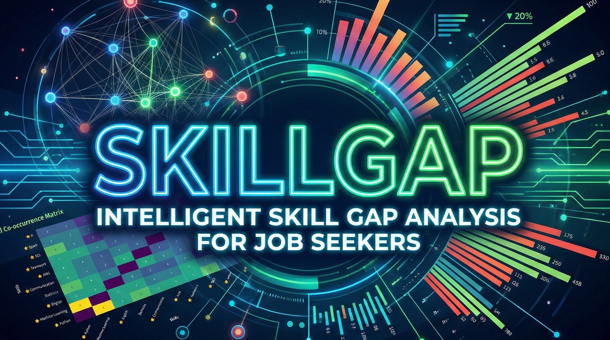
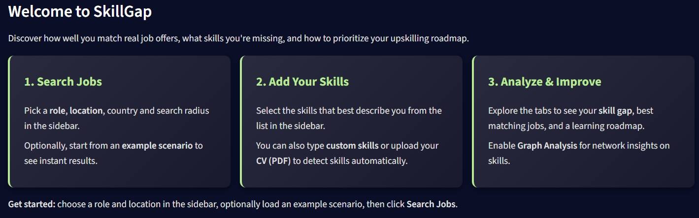

# Skill Gap Analysis
**Authors**: Carolina Lopez de la Madriz, Emma Rodriguez Hervas, Álvaro Martin Ruiz & Iker Rosales Saiz


A career-analytics platform that identifies the gap between a candidate’s current skill set and the requirements of their target roles.
It retrieves job postings from external APIs (primary: **JSearch / OpenWebNinja**) and provides an interactive **Streamlit dashboard** for skill extraction, gap scoring, graph-based analytics, recommendations, reporting and **real job offers link**!.



## Quickstart

1. **Install dependencies**

```bash
pip install -r requirements.txt
```

2. **Download the spaCy multilingual model**

```bash
python -m spacy download xx_ent_wiki_sm
```

3. **Create a `.env` file at the repository root**

```env
# Primary job search API
API_KEY_JSEARCH=your_jsearch_api_key
```

4. **Launch the Streamlit dashboard**

```bash
streamlit run app.py
```

## Key Features

* **Job Search & Caching**

  * Integration with JSearch/OpenWebNinja APIs.
  * Local caching layer to minimize API calls.

* **NLP Skill Extraction**

  * spaCy-based extraction pipeline.
  * Taxonomy-driven synonym normalisation.
  * Custom taxonomy management via `create_taxonomy_file.py`.

* **Skill Gap Analysis**

  * Comparison between user-declared skills and job requirements.
  * Seniority inference (junior / mid / senior).
  * Match ratios and weighted gap scoring.

* **Advanced Analytics**

  * Skill co-occurrence networks (NetworkX).
  * Graph community detection and centrality metrics.
  * Role clustering using scikit-learn.

* **Interactive Dashboard**

  * Streamlit multi-tab interface: overview, skills, matches, recommendations, graph analysis.
  * Real job offers with useful links to apply to the positions that you fit the most!


## Technologies & Libraries

**Language & Frameworks**

* Python 3.10+
* Streamlit (dashboard UI)

**NLP**

* spaCy (`xx_ent_wiki_sm` model)
* Custom taxonomy-based matching

**Data & Analytics**

* pandas, NumPy
* scikit-learn (clustering, vectorisation)
* NetworkX (graph construction & centrality)
* community / python-louvain (community detection)

**Visualisation**

* Streamlit native charts
* Plotly (interactive figures)
* Network visualization exported as HTML

**APIs**

* JSearch / OpenWebNinja (primary job search)


## Project Structure

```
skill_gap_analysis/
├── app.py                     # Streamlit entrypoint orchestrating the UI
├── core/
│   ├── api_client.py          # API integration + caching
│   ├── skills_extraction.py   # NLP extraction + taxonomy logic
│   ├── analysis.py            # Gap scoring and clustering
│   ├── graph_analysis.py      # Network analytics (centrality, detection)
│   └── config.py              # Configuration utilities
├── ui/
│   ├── components.py          # Custom UI components
│   ├── sidebar.py             # Sidebar inputs and preprocessing
│   ├── styles.py              # Dashboard CSS
│   ├── tabs/                  # Individual tab views
│   │   ├── overview.py
│   │   ├── skills_analysis.py
│   │   ├── job_matches.py
│   │   ├── recommendations.py
│   │   └── graph_analysis.py
│   └── welcome.py             # Landing screen
├── data/
│   ├── taxonomy_skills.csv    # Skill taxonomy + synonyms
│   ├── raw_jobs_*.json        # Example API outputs
│   └── temp_graph.html        # Cached graph visualisation
├── create_taxonomy_file.py    # Helper for building/extending the taxonomy
├── requirements.txt
└── LICENSE
```

## How It Works

This project implements an end-to-end career analytics pipeline that transforms raw job postings into actionable insights through NLP, graph theory, and interactive visualisation.

### 1. Job Data Ingestion

* Fetches job postings via **JSearch (OpenWebNinja API)** as the primary data source.
* Supports configurable search parameters (role, location, seniority, keywords).
* Uses **local caching** to:

  * Reduce redundant external API calls
  * Improve performance
  * Respect rate limits
* Normalises raw JSON responses into a structured internal representation for downstream processing.

### 2. Skill Extraction & Normalisation (NLP)

* Cleans and preprocesses job descriptions (HTML removal, text normalisation).
* Uses **spaCy-based NLP pipelines** to extract skill candidates from unstructured text.
* Applies a **domain-specific skill taxonomy** to:

  * Normalise synonyms and variants (e.g. `PyTorch`, `pytorch`, `torch`)
  * Reduce noise and false positives
  * Ensure consistent skill representation across sources
* Aggregates and deduplicates skills across all job postings.


### 3. User Skill Profiling

* Users define their current skill set manually or via CV/PDF parsing.
* Optional **self-assessed proficiency levels** can be assigned per skill.
* User skills are processed with the same taxonomy and normalisation logic to ensure a fair comparison with market demand.

### 4. Skill Gap & Market Alignment Analysis

* Compares user skills against aggregated job requirements.
* Identifies:

  * Missing or underrepresented skills
  * Low-impact or overrepresented skills
* Ranks gaps using:

  * Skill frequency across job postings
  * Graph-based importance metrics
  * Relevance to detected job seniority
* Estimates **job seniority (junior / mid / senior)** based on requirement patterns and linguistic signals in job descriptions.

### 5. Advanced Analytics (Graphs & Clustering)

* Builds a **skill co-occurrence graph** from job postings.
* Computes multiple network metrics:

  * Degree centrality
  * Betweenness centrality
  * Closeness centrality
  * Eigenvector centrality
* Identifies:

  * Core skills with high structural importance
  * Bridge skills connecting multiple domains
  * Peripheral or niche skills
* Detects skill communities using:

  * Louvain
  * Label Propagation
  * Greedy Modularity
* Performs **semantic skill clustering** using vector embeddings (`BAAI/bge-small-en-v1.5`) to group related skills and job profiles.

### 6. Visualisation & Reporting

* Provides an interactive **Streamlit dashboard** with:

  * Skill coverage overview
  * Ranked gap analysis and recommendations
  * Job–skill matching insights
  * Interactive network and community visualisations
* Network graphs can be **exported as standalone HTML** for easy sharing.
* The architecture is designed to support future integrations with external BI tools.

### Architecture Overview

```
Job APIs → NLP & Taxonomy → Skill Analytics → Graph & Clustering → Streamlit UI
```


## Dashboard Preview

### Take a look of the last demo:

[](https://www.youtube.com/watch?v=xeKAscK2d8o "Demo SkillGap - Intelligent Skill Gap Analysis for Job Seekers - YouTube")

## Limitations

- **Optimised for Data & AI roles:** The current pipeline and taxonomy ensure reliable performance mainly for technical positions in Data & AI. Other domains may yield incomplete or noisier results.

- **Taxonomy-dependent adaptability:** Expanding the taxonomy is required to support additional industries. With a well-designed taxonomy, the system can be adapted to virtually any job family.

- **Model and API variability:** Skill extraction depends on a general-purpose spaCy model and on the structure of external job APIs, which may introduce inconsistencies or reduce precision in certain postings.

## Authors

* Carolina López De La Madriz
* Emma Rodríguez Hervas
* Álvaro Martín Ruiz
* Iker Rosales Saiz
